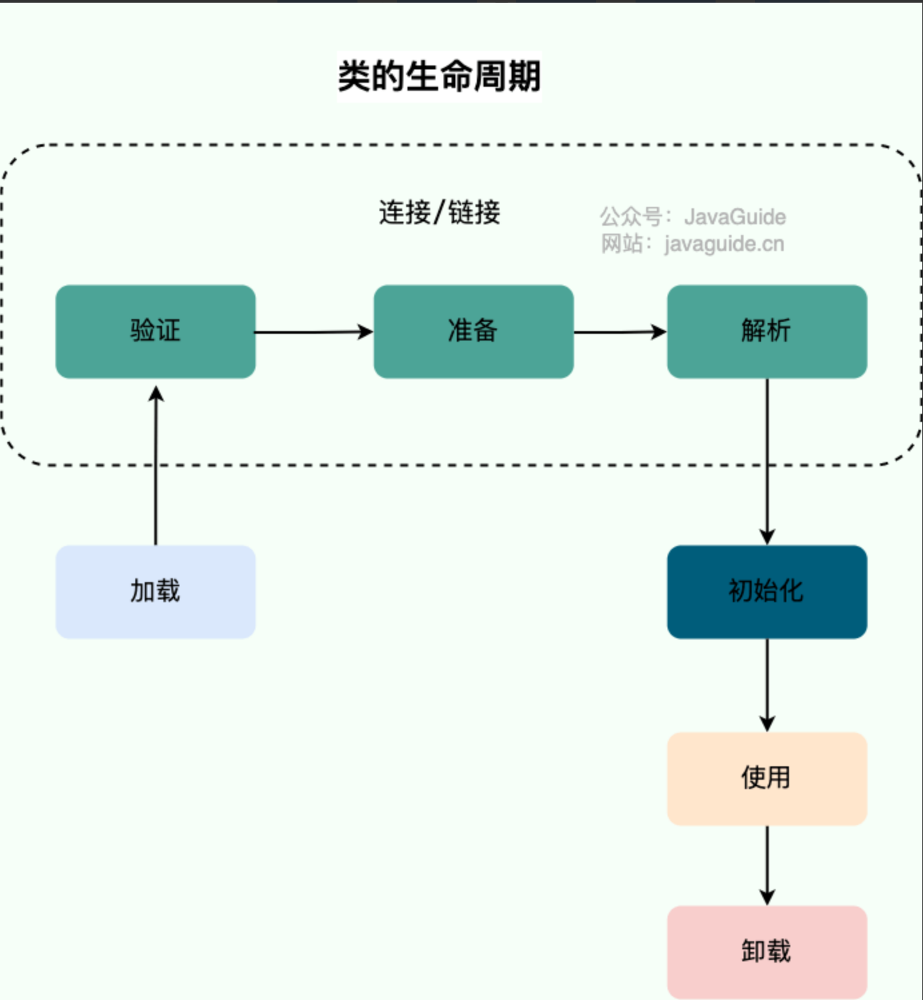
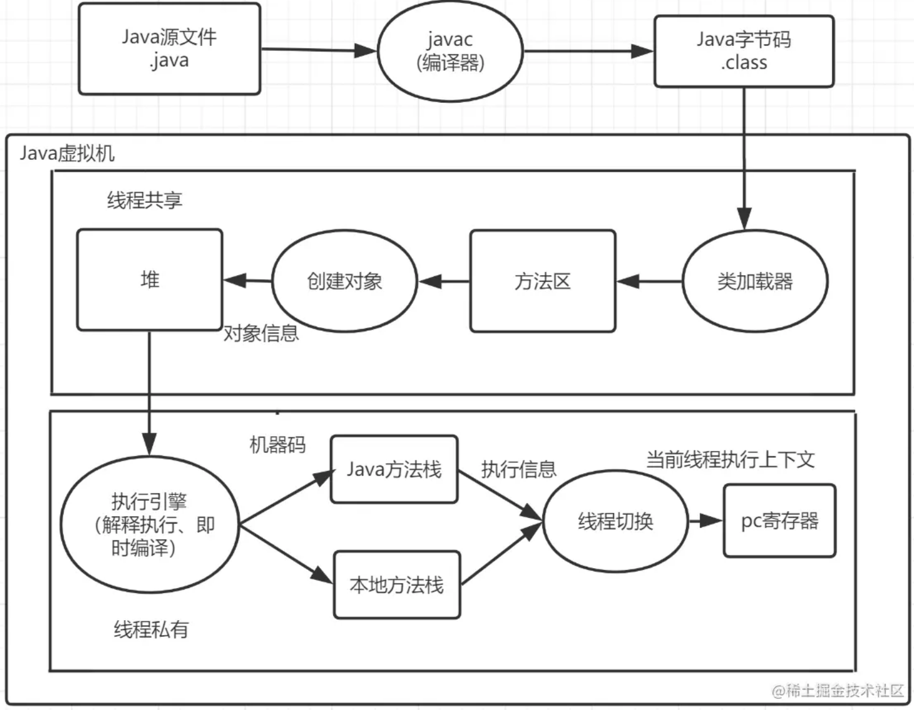
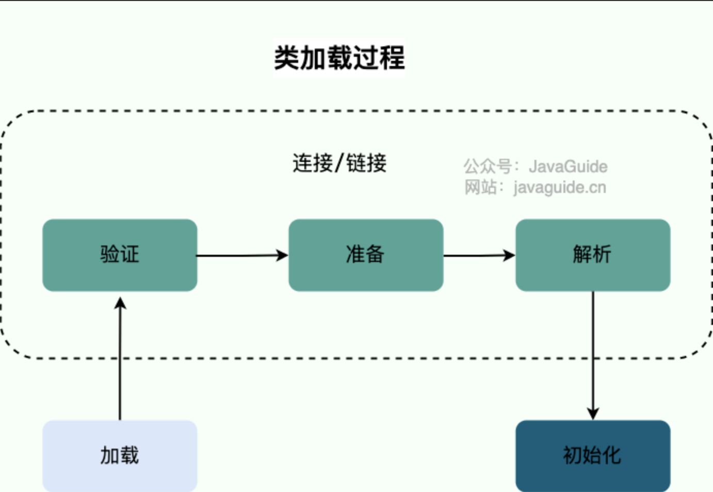

### JVM概念

#### 什么是JVM

Java Virtual Machine -- java程序的运行环境（java二进制字节码的运行环境）

#### 学习线路

### 内存结构

> 私有区域：程序计数器 、 虚拟机栈、本地方法栈
>
> 共享区域：堆、方法区

#### 1.程序计数器

##### 1.1 定义

程序计数器是一块较小的内存空间，可以看作是当前线程所执行的字节码的行号指示器。

##### 1.2 作用

* 字节码解释器通过改变程序计数器来依次读取指令，从而实现代码的流程控制，如：顺序执行、选择、循环、异常处理。
* 在多线程的情况下，程序计数器用于记录当前线程执行的位置，从而当线程被切换回来的时候能够知道该线程上次运行到哪儿了。

> 注意

程序计数器是唯一一个不会出现 `OutOfMemoryError` 的内存区域，它的生命周期随着线程的创建而创建，随着线程的结束而死亡。

#### 2.虚拟机栈

* 每个线程运行时所需要的内存，称为虚拟机栈
* 每个栈由多个栈帧组成，对应着每次方法调用时所占用的内存
* 每个线程只能有一个活动栈帧，对应着当前正在执行的那个方法
* 每个栈帧中都拥有：局部变量表、操作数栈、动态链接、方法返回地址。
  * **`局部变量表`**包含各种数据类型(boolean、byte、char、short、int、float、long、double)，对象引用。
  * **`操作数栈`**主要作为方法调用的中转站使用，用于存放方法执行过程中产生的中间计算结果。计算过程中产生的临时变量也会放在操作数栈中。
  * **`动态链接`**当一个方法要调用其他方法，需要将常量池中指向方法的符号引用转化为其在内存地址中的直接引用。
  * **`方法返回地址`**Java 方法有两种返回方式，一种是 return 语句正常返回，一种是抛出异常。不管哪种返回方式，都会导致栈帧被弹出。也就是说，栈帧随着方法调用而创建，随着方法结束而销毁。无论方法正常完成还是异常完成都算作方法结束。

>问题：垃圾回收是否涉及栈内存？

垃圾回收只能回收堆里面的东西，不能回收栈内存

> 问题：方法内的局部变量是否线程安全？

因为每创建一个方法，都会在栈中新创建一个栈帧，所以每个栈帧中的元素都不会相互影响

#### 3.本地方法栈

和虚拟机栈所发挥的作用非常相似

区别是： 

* **虚拟机栈为虚拟机执行 Java 方法 （也就是字节码）服务，**

* **而本地方法栈则为虚拟机使用到的 Native 方法服务。** 

#### 4.堆

##### 4.1 目的

存放对象实例，几乎所有的对象实例以及数组都在这里分配内存

##### 4.2 特点

java堆是垃圾收集器管理的主要区域，也称GC堆

#### 5.方法区

### 类加载过程

#### 类的生命周期

类从被加载到虚拟机内存中开始到卸载出内存为止，它的整个生命周期可以简单概括为 7 个阶段：：加载（Loading）、验证（Verification）、准备（Preparation）、解析（Resolution）、初始化（Initialization）、使用（Using）和卸载（Unloading）。

#### Java代码运行过程

#### 类加载过程

系统加载 Class 类型的文件主要三步：**加载->连接->初始化**。连接过程又可分为三步：**验证->准备->解析**。

##### 加载

将类的二进制数据读入到Java虚拟机（JVM）中，并将其存储在方法区中。类加载器负责这个过程。

具体来说，当程序需要使用一个类时，JVM会检查这个类是否已经被加载。如果没有加载，JVM会根据类的全限定名（Fully Qualified Name）找到该类对应的二进制字节码文件，并将其加载到内存中。

类加载的过程包括以下几个步骤：

1. 定位类文件：类加载器首先需要找到类文件。类文件通常以.class为文件扩展名，保存在文件系统中、网络中或其他任何可以被类加载器访问的位置。
2. 读取类文件：当类文件被定位之后，类加载器需要读取类文件中的二进制数据，并将其转换为JVM内部可以理解的数据结构。这个转换的过程包括解析类的常量池、字段、方法等信息，并将其存储在JVM的方法区中。
3. 创建类对象：当类文件被读取之后，JVM会创建一个对应的Class对象来代表这个类。Class对象包含了该类的方法、字段等信息，并且还包含了该类的父类、接口等信息。

##### 验证

验证是连接阶段的第一步，这一阶段的目的是确保 Class 文件的字节流中包含的信息符合《Java 虚拟机规范》的全部约束要求，保证这些信息被当作代码运行后不会危害虚拟机自身的安全。

1. 文件格式验证（Class 文件格式检查）：验证字节码文件是否符合Java字节码规范，例如字节码是否以魔数0xCAFEBABE开头，常量池中的常量是否符合规范等等。
2. 元数据验证（字节码语义检查）：验证字节码文件中的元数据信息是否符合Java语言规范，例如类的继承关系、字段类型和访问修饰符、方法参数和返回值类型等等。
3. 字节码验证（程序语义检查）：验证字节码文件是否符合JVM规范，例如是否包含非法的操作码、方法调用的参数是否匹配等等。
4. 符号引用验证（类的正确性检查）：验证字节码文件中的符号引用是否能够正确地解析，例如是否能够正确地找到类、字段和方法等等。

##### 准备

**准备阶段是正式为类变量分配内存并设置类变量初始值的阶段**，这些内存都将在方法区中分配。

类加载准备阶段是类加载过程的第二个阶段，主要完成以下两个任务：

* 为类变量分配内存空间并设置默认值。对于基本类型，其默认值为0或false，对于引用类型，其默认值为null。

需要注意的是，这里分配的内存空间并不包括对象实例的成员变量。对象实例的成员变量是在实例化对象时动态分配的。

* 将类变量和常量池中的常量赋值。这里的常量包括编译期间就确定的常量，例如字符串常量、基本类型常量等等。

在准备阶段完成后，类变量和常量的内存空间都已经准备好了，并且已经赋予了默认值或者常量值，这些变量可以被程序访问和使用。

需要注意的是，类变量和常量池中的常量的赋值都是在准备阶段完成的，而非在初始化阶段。在初始化阶段，程序可以对类变量和常量进行进一步的赋值和初始化。

##### 解析

类加载解析阶段是类加载过程的第四个阶段，主要完成以下两个任务：

* 符号引用转换为直接引用：在Java程序中，类、字段和方法的引用通常是符号引用，即用符号来表示所引用的目标。在类加载解析阶段，JVM会将符号引用转换为直接引用，即用直接指针或偏移量来表示所引用的目标。这样可以提高程序的执行效率。

* 常量池中的符号引用替换为直接引用：在Java字节码文件中，常量池中存储了各种符号引用，包括类名、字段名、方法名等等。在类加载解析阶段，JVM会将常量池中的符号引用替换为直接引用，以便在程序运行时快速访问所引用的目标。

需要注意的是，类加载解析阶段并不一定是在类加载过程的第四个阶段执行的，它可能会在类加载的任何时候执行，例如当程序调用一个尚未加载的类、字段或方法时，JVM会在运行时进行解析并将其转换为直接引用。