索引

### MyISAM 和 InnoDB 有什么区别？

MySQL 5.5 之前，MyISAM 引擎是 MySQL 的默认存储引擎；MySQL 5.5 版本之后，InnoDB 是 MySQL 的默认存储引擎。

**1.是否支持行级锁**

* MyISAM 只有表级锁
*  InnoDB 支持行级锁和表级锁，默认为行级锁

**2.是否支持事务**

* MyISAM 不提供事务支持

* InnoDB 提供事务支持，实现了 SQL 标准定义了四个隔离级别，具有提交和回滚事务的能力

**3.是否支持外键**

* MyISAM 不支持

* InnoDB 支持

**4.是否支持数据库异常崩溃后的安全恢复**

* MyISAM 不支持

* InnoDB 支持

**5.索引实现不一样**

* MyISAM 引擎和 InnoDB 引擎都是使用 B+Tree 作为索引结构，但是两者的实现方式不太一样。

* InnoDB 引擎中，其数据文件本身就是索引文件。相比 MyISAM，索引文件和数据文件是分离的，其表数据文件本身就是按 B+Tree 组织的一个索引结构，树的叶节点 data 域保存了完整的数据记录。

### 索引

#### 概念

**索引是一种用于快速查询和检索数据的数据结构，其本质可以看成是一种排序好的数据结构。**

索引的作用就相当于书的目录。打个比方: 我们在查字典的时候，如果没有目录，那我们就只能一页一页的去找我们需要查的那个字，速度很慢。如果有目录了，我们只需要先去目录里查找字的位置，然后直接翻到那一页就行了。

索引底层数据结构存在很多种类型，常见的索引结构有: B 树， B+树 和 Hash、红黑树。在 MySQL 中，无论是 Innodb 还是 MyIsam，都使用了 B+树作为索引结构。

#### 优缺点

**优点** ：

- 使用索引可以大大加快数据的检索速度（大大减少检索的数据量）, 这也是创建索引的最主要的原因。
- 通过创建唯一性索引，可以保证数据库表中每一行数据的唯一性。

**缺点** ：

- 创建索引和维护索引需要耗费许多时间。当对表中的数据进行增删改的时候，如果数据有索引，那么索引也需要动态的修改，会降低 SQL 执行效率。
- 索引需要使用物理文件存储，也会耗费一定空间。

#### 索引的底层数据结构

**Hash表**

哈希表是键值对的集合，通过键(key)即可快速取出对应的值(value)，因此哈希表可以快速检索数据（接近 O（1））。

**B树 & B+树**

B 树也称 B-树,全称为 **多路平衡查找树** ，B+ 树是 B 树的一种变体。B 树和 B+树中的 B 是 `Balanced` （平衡）的意思。

目前大部分数据库系统及文件系统都采用 B-Tree 或其变种 B+Tree 作为索引结构。

### MySQL三大日志

`MySQL` 日志 主要包括错误日志、查询日志、慢查询日志、事务日志、二进制日志几大类。其中，比较重要的还要属二进制日志 `binlog`（归档日志）和事务日志 `redo log`（重做日志）和 `undo log`（回滚日志）。

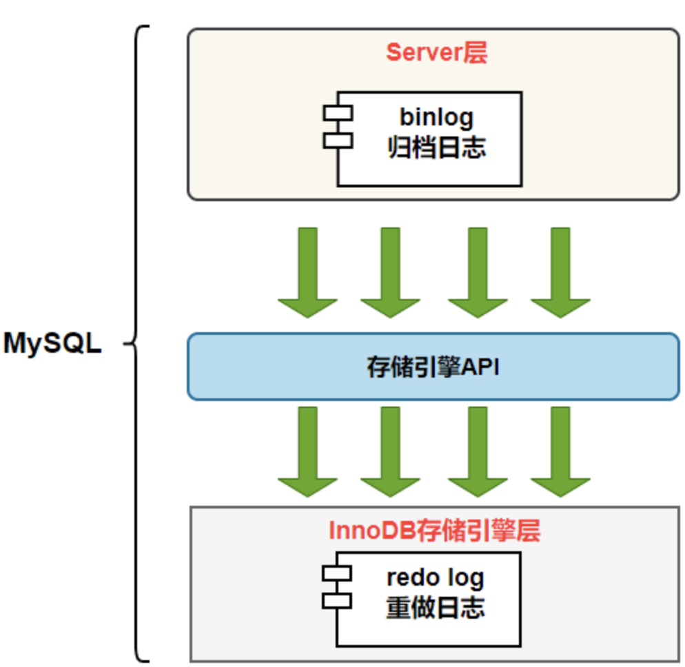

#### Redo Log（重做日志）

##### 内容和作用

`Redo Log`记录的是物理日志，也就是磁盘数据页的修改。

作用：用来保证服务崩溃后，仍能把事务中变更的数据持久化到磁盘上

当`MySQL`实例挂了或者宕机了，重启的时候`InnoDB`存储引擎会使用`rede log`日志恢复数据，保证事务的持久性和完整性。如下图：

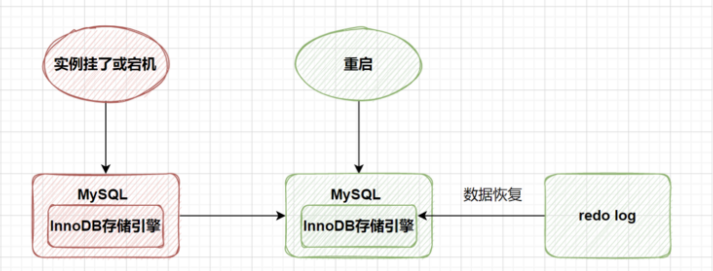

`MySQL`中数据是以页为单数存储，当你查询一条记录时，硬盘会把一整页的数据加载出来，加载出来的数据叫做数据页，会放到`Buffer Pool`中。后续的查询都是先从`Buffer Pool`中找，没有找到再去硬盘加载其他的数据页直到命中，这样子可以减少磁盘`IO`的次数，提高性能。更新数据的时候也是一样，优先去`Buffer Pool`中找，如果存在需要更新的数据就直接更新。然后会把“在某个数据页做了什么修改”记录到重做日志缓存（`redo log buffer`）里，在刷盘的时候会写入`redo log`日志文件里。

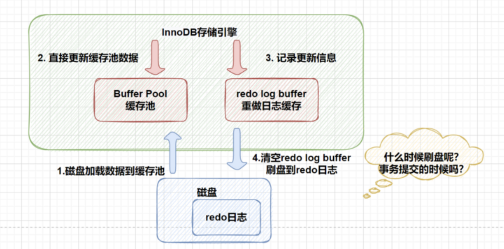

##### 刷盘时机

理想情况下，事务一提交就会进行刷盘操作，但是实际上是刷盘的时机是根据策略来决定的。

`InnoDB`引擎中使用`innodb_flush_log_at_trx_commit`来设置`redo log`的刷盘时机策略，其可以设置支持三种策略。

- `innodb_flush_log_at_trx_commit`为0，表示每次提交事务时不会刷盘；
- `innodb_flush_log_at_trx_commit`为1，表示每次提交事务时会刷盘，即先将`redo log buffer`内容写入`page cache`，然后调用`fsync`函数将`page cache`中的内容刷到磁盘上；
- `innodb_flush_log_at_trx_commit`为2，表示每次提交事务时，仅将`redo log buffer`内容写入`page cache`。

同时，`InnoDB`引擎有一个后台线程，其1秒执行一次，会将**`redo log buffer`**的内容写入**`page cache`**，然后再调用`fsync`函数将**`page cache`**中的内容写到磁盘的**`redo log`**文件中，所以**`innodb_flush_log_at_trx_commit`**的值无论设置为0，1或者2，最终都是可以将**`redo log buffer`**的内容写到磁盘的**`redo log`**文件中的。下面给出**`innodb_flush_log_at_trx_commit`**被设置为不同值时的刷盘示意图。

> **innodb_flush_log_at_trx_commit = 0**

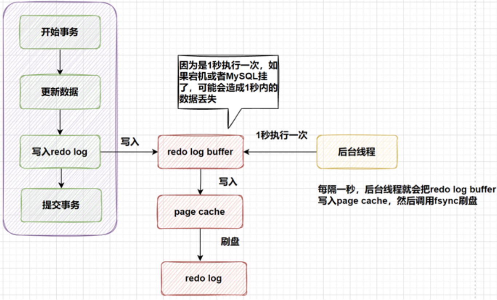

> **innodb_flush_log_at_trx_commit = 1**

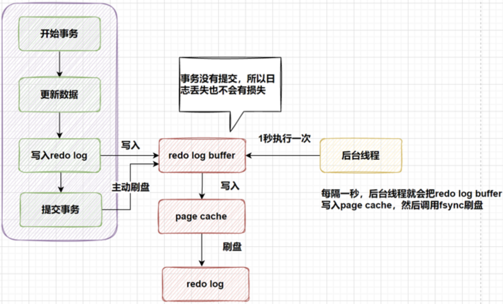

> **innodb_flush_log_at_trx_commit = 2**

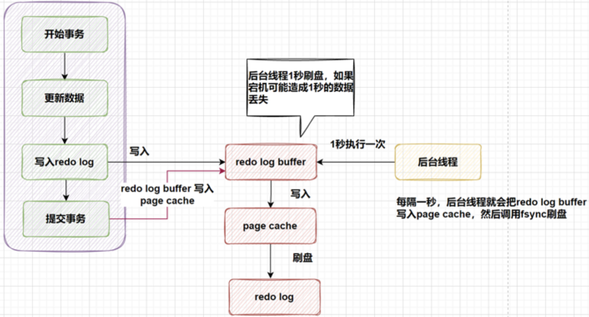

因此可以知道，**`innodb_flush_log_at_trx_commit`**设置为0或者2时，在`MySQL`宕机时可能会造成1秒内的数据丢失，而**`innodb_flush_log_at_trx_commit`**设置为1时，不会造成数据丢失，**`innodb_flush_log_at_trx_commit`=1**也是`InnoDB`的默认设置。

最后，用一个图进行刷盘时机的总结。

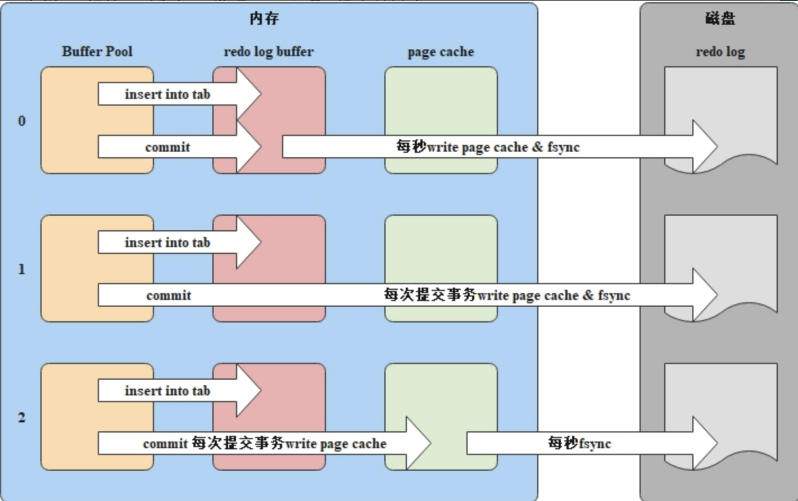

##### 日志文件组

硬盘上存储的`redo log`日志文件不止一个，而是一个**日志文件组**的形式出现的，每个的`redo log`文件大小都是一样的。它采用的是环形数组形式，从头开始写，写到末尾回到头循环写，如下图所示：

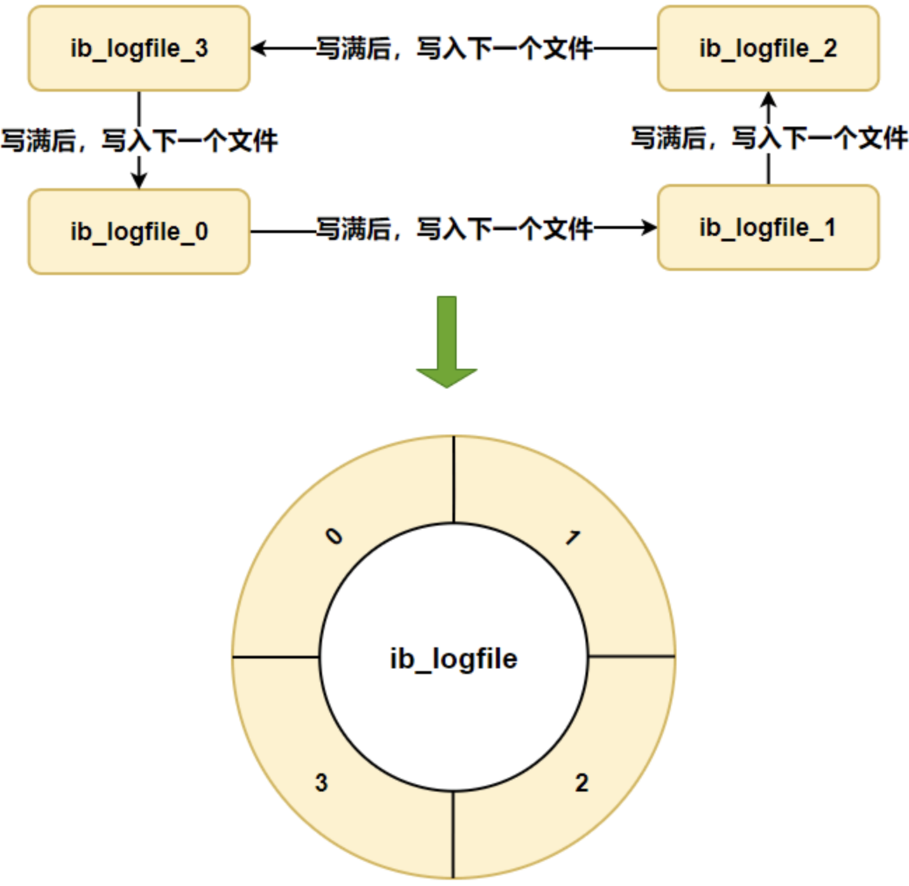

在**日志文件组**中有两个重要的属性，分别是`witre pos、checkpoint`

- **`wirte pos`**：是当前记录的位置，一边写一边后移。
- **`checkpoint`**：是当前要擦除的位置，也是后台推移。

**`write pos`**与**`checkpoint`**之间的位置，表示**redo log**上可以写入的部分，如下所示。

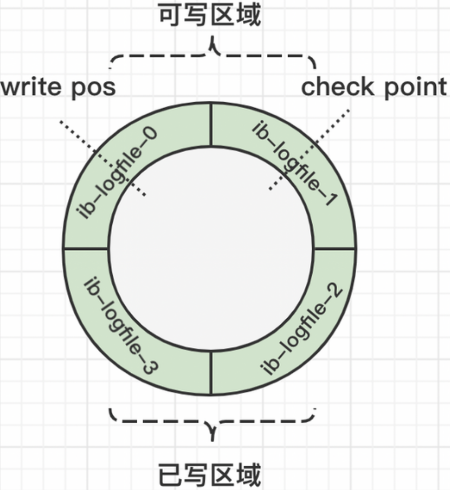

#### binlog（归档日志）

`redo log`是物理日志，记录的是“在某个数据页做了什么修改”，属于`Innodb`存储引擎。

而`binlog`日志是逻辑日志，记录内容是语句的原始逻辑，属于`MySQL Server`层。所有的存储引擎只要发生了数据更新，都会产生`binlog`日志。

##### 日志作用

可以说`MySQL`数据库的**数据备份、主备、主主、住从**都离不开`binlog`，需要依赖`binlog`来同步数据，保证数据一致性。

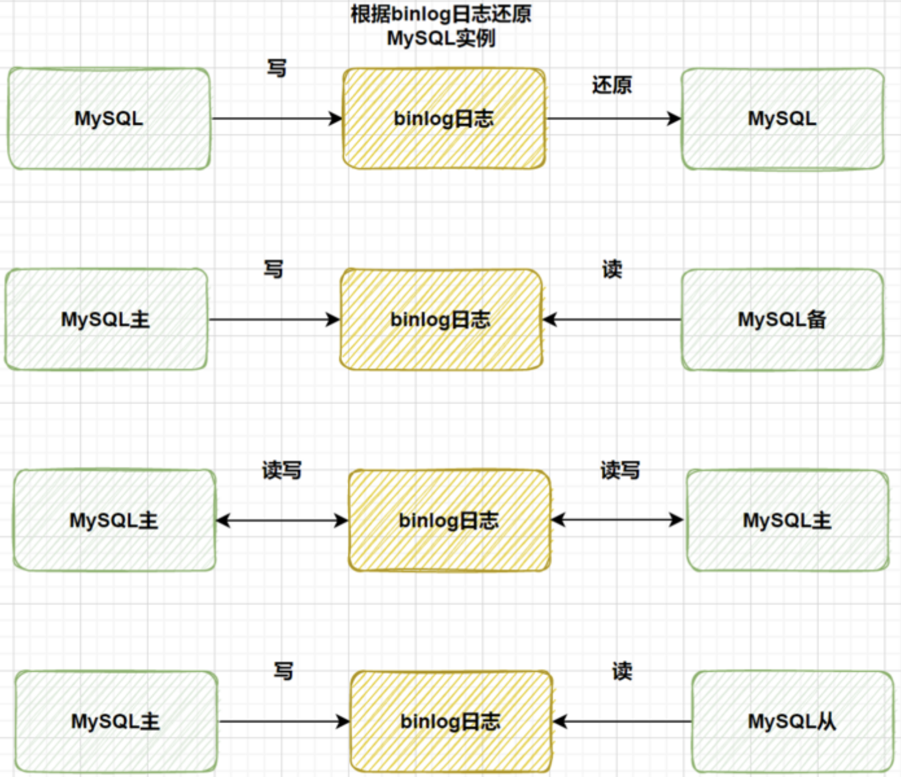

##### 记录格式

`binlog`日志有三种格式，可以通过`binlog_format`参数设置，有以下三种：

- **statement**
- **row**
- **mixed**

设置`statement`记录的内容是`SQL`语句原文，比如执行一条`update T set update_time = now() where id = 1`，记录内容如下：

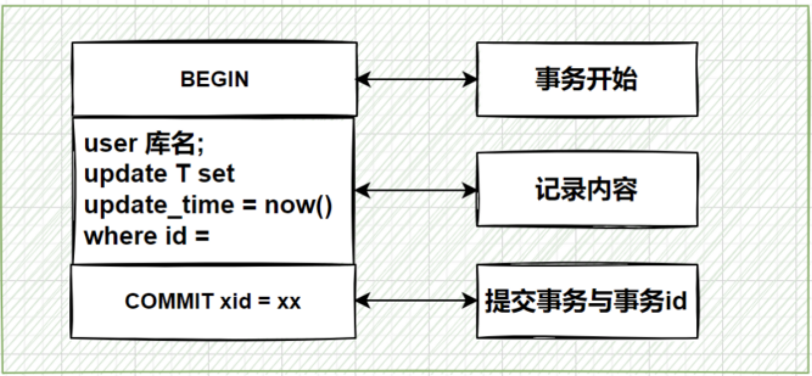

同步数据时，会执行记录的`SQL`语句，但是有个问题`update_time = now()`这里会获取到当前系统问题，直接执行会导致与原库数据不一致。

为了解决这种问题，我们需要将`binlog_format`设置成`row`，记录的不再是简单的`SQL`语句了，还包含了操作的具体数据，记录内容如下：

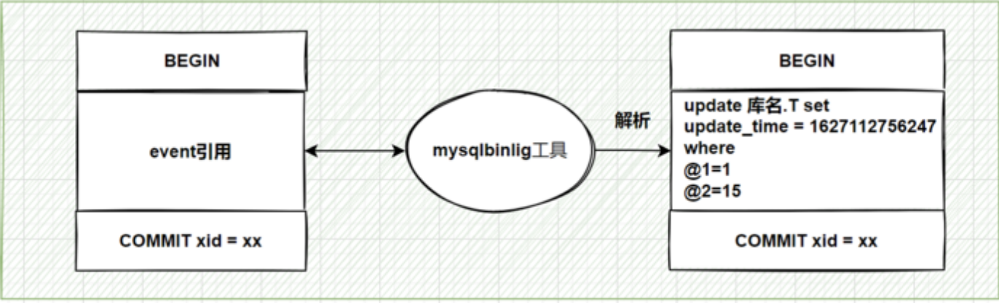

`row`格式记录的内容看不到详细信息，通过`mysqlbinlog`工具解析出来。

`update_time = now()`变成了具体的时间，条件后面的`@1、@2`都是该行数据第1个~2个字段的原始值（假设这张表只有2个字段）。

设置成`row`带来的好处就是同步数据的一致性，通常情况都设置成`row`，这样可以为数据库的恢复与同步带来更好的可靠性。但是这种格式需要大量的容量来记录，比较占用空间，恢复与同步时会更消耗`IO`资源，影响执行速度。

所以又有了一种折中方案，设置为`mixed`，记录的内容是前两者的混合。

`MySQL`会判断这条`SQL`语句是否会引起数据不一致，如果是就用`row`格式，否则就用`statement`格式。

##### 写入机制

当开启事务后，在事务执行过程中，会将**`DDL`**和**`DML`**的操作记录到**`binlog cache`**中，当提交事务时，就会将**`binlog cache`**中的内容先写到**`page cache`**，然后通过`fsync`函数将**`page cache`**的内容写到磁盘上的**`binlog`**。

`MySQL`提供了**`sync_binlog`**参数来控制具体的写入策略，可以通过`SHOW VARIABLES LIKE 'sync_binlog%'`语句进行查看。**`sync_binlog`**参数的取值和说明如下所示。

- **`sync_binlog`**设置为0，表示每次提交事务时，会将**`binlog cache`**的内容写入**`page cache`**，然后由操作系统决定什么时候将**`page cache`**的内容写到**`binlog`**；
- **`sync_binlog`**设置为1，表示每次提交事务时，会将**`binlog cache`**的内容写入**`page cache`**，然后调用`fsync`函数将**`page cache`**的内容写到**`binlog`**；
- **`sync_binlog`**设置为**n**（**n >** 1），表示每次提交事务时，会将**`binlog cache`**的内容写入**`page cache`**，当向**`page cache`**写入数据的事务达到**n**个，此时调用`fsync`函数将**`page cache`**的内容写到**`binlog`**。

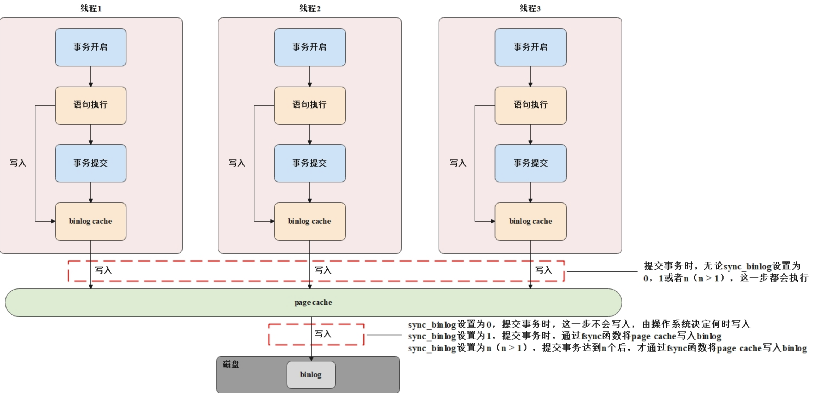

##### 两阶段提交

现在已知，在开启事务后，由于后台线程的存在，事务执行过程中是可以不断向**redo log**写入内容的，而**`binlog`**只能在事务提交时被写入，所以实际上**`redo log`**和**`binlog`**的写入时机是不相同的，这就导致当发生`MySQL`宕机时可能会出现**`redo log`**和**`binlog`**所包含的逻辑内容不一致的问题。

比如现在执行一条更新`SQL`语句`UPDATE student SET stu_age=22 WHERE id=1`，如果这条语句的修改写到了**`redo log`**中，但是在写到**`binlog`**前`MySQL`发生宕机，然后`MySQL`重启之后会根据**redo log**进行数据恢复，由于**`redo log`**中有更新`SQL`语句的修改数据，所以这条更新`SQL`语句的修改结果会写到磁盘中，但是**`binlog`**中是没有这条更新`SQL`语句的，就会导致后续基于**`binlog`**进行主从同步等操作时会出现主和从数据不一致的问题。

为了解决上述的问题，在`InnoDB`引擎中，使用了两阶段提交来解决。具体的实现就是将**`redo log`**的写入分为两个阶段，示意图如下所示。

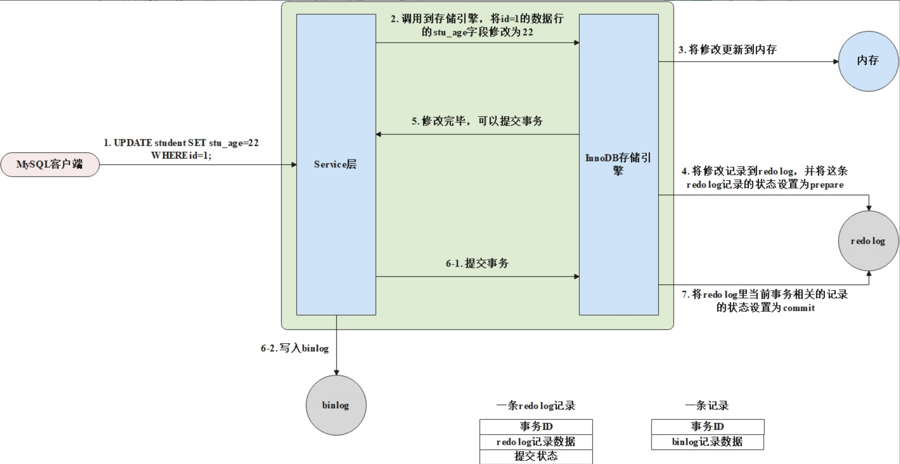

由上图可知，一条**`redo log`**记录可以由**事务`ID` + `redo log`记录数据 + 提交状态**组成，提交状态可以是**`prepare`**和**`commit`**，当第一次将一个数据修改写入**redo log**时，这条**`redo log`**记录的状态为**`prepare`**，这是第一阶段提交，后续提交事务时，会在**`redo log`**中将这个事务对应的记录的状态置为**`commit`**，这是第二阶段提交。根据上述的两阶段提交的写入方式，再结合**`binlog`**，可以在发生`MySQL`宕机导致**`redo log`**和**`binlog`**逻辑内容不一致时判断事务是否需要进行回滚。具体的判断策略如下所示。

- **`binlog`**无记录，**`redo log`**无记录。表示在第一阶段提交前发生宕机，此时需要回滚事务；
- **`binlog`**无记录，**`redo log`**记录状态为**`prepare`**。表示在**`binlog`**写完之前发生宕机，此时需要回滚事务；
- **`binlog`**有记录，**`redo log`**记录状态为**`prepare`**。表示在**`binlog`**写完之后，事务完成提交之前发生宕机，此时需要提交事务；
- **`binlog`**有记录，**`redo log`**记录状态为**`commit`**。表示是正常完成的事务，此时无需进行操作。

#### undo log（回滚日志）

**`undo log`**叫做**回滚日志**，属于`InnoDB`引擎。**`undo log`**记录了某条数据变更前的旧数据，当事务需要回滚时，可以通过**`undo log`**将数据恢复为事务修改前的数据，所以`InnoDB`引擎中使用**`undo log`**来保证了事务的原子性。

通常情况下，一条更新语句执行，写入三大日志的顺序为**`undo log`**先于**`redo log`**，**`redo log`**先于**`binlog`**。