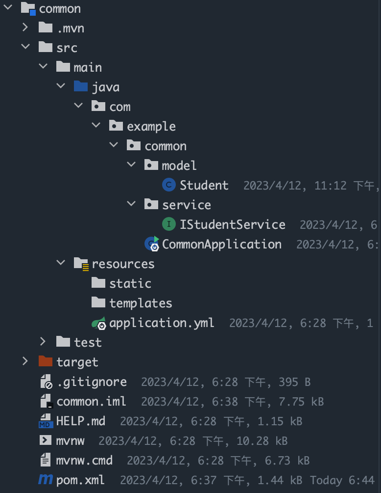
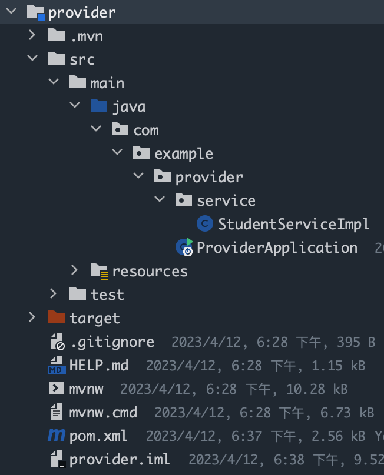
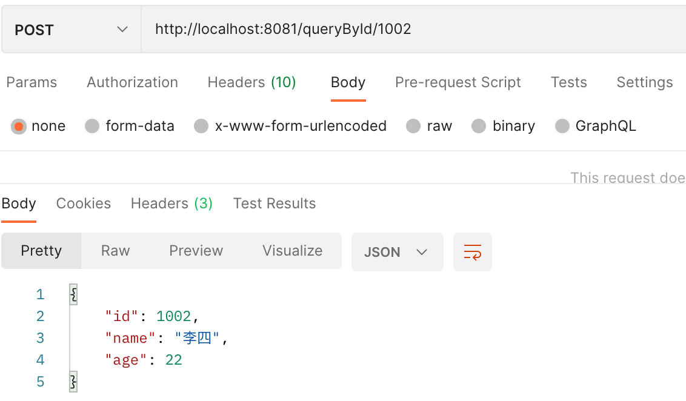

## 一、启动zookeeper

停止：`zkServer stop`

开启：`zkServer start`

## 二、安装Dubbo-admin

用于本地看有没有服务注册到zookeeper中

* dubbo-admin-server：启动
* dubbo-admin-ui ：首先`npm install` ， 然后 `npm run dev` ，打开前端页面，用户名/密码：`root / root`

## 三、集成步骤

本项目是在父类项目`Dubbo`下，创建了三个`springboot`小项目，分别为`common`，`provider`，`customer`。`common`用于创建实体类和接口，`provider`用于提供接口实现类，`customer`用于接收`provider`提供的信息

### 3.1 公共组件

结构图如下所示：



**`Student`**类

```java
package com.example.common.model;
import java.io.Serializable;

public class Student implements Serializable {
    private Integer id;
    private String name;
    private Integer age;
    public Integer getId() {
        return id;
    }
    public void setId(Integer id) {
        this.id = id;
    }
    public String getName() {
        return name;
    }
    public void setName(String name) {
        this.name = name;
    }
    public Integer getAge() {
        return age;
    }
    public void setAge(Integer age) {
        this.age = age;
    }
}
```

**`IStudentService`**类

```java
package com.example.common.service;
import com.example.common.model.Student;

public interface IStudentService {
    Student queryById(Integer id);
}
```

### 3.2 提供者

结构图如下所示：



**`pom`**文件

```java
<!-- 引入公共依赖项 -->
<dependency>
    <groupId>com.example</groupId>
    <artifactId>common</artifactId>
    <version>0.0.1-SNAPSHOT</version>
</dependency>

<!-- 引入dubbo的依赖 -->
<!-- https://mvnrepository.com/artifact/org.apache.dubbo/dubbo-spring-boot-starter -->
<dependency>
    <groupId>org.apache.dubbo</groupId>
    <artifactId>dubbo-spring-boot-starter</artifactId>
    <version>2.7.8</version>
</dependency>
<!-- zookeeper依赖 -->
<!-- https://mvnrepository.com/artifact/org.apache.dubbo/dubbo-dependencies-zookeeper -->
<dependency>
    <groupId>org.apache.dubbo</groupId>
    <artifactId>dubbo-dependencies-zookeeper</artifactId>
    <version>2.7.8</version>
    <type>pom</type>
    <exclusions>
        <exclusion>
            <groupId>org.slf4j</groupId>
            <artifactId>slf4j-log4j12</artifactId>
        </exclusion>
    </exclusions>
</dependency>

<dependency>
    <groupId>org.springframework.boot</groupId>
    <artifactId>spring-boot-starter-web</artifactId>
</dependency>

<dependency>
    <groupId>org.springframework.boot</groupId>
    <artifactId>spring-boot-starter-test</artifactId>
    <scope>test</scope>
</dependency>
```

**`StudentServiceImpl`**类

```java
package com.example.provider.service;

import com.example.common.model.Student;
import com.example.common.service.IStudentService;
import org.apache.dubbo.config.annotation.DubboService;
import org.apache.dubbo.config.annotation.Service;
import org.springframework.stereotype.Component;

//注意下，这是的注解是dubbo的注解，不是springboot的
@Service
public class StudentServiceImpl implements IStudentService {

    @Override
    public Student queryById(Integer id) {
        Student student = new Student();
        if (1001==id) {
            student.setAge(21);
            student.setId(id);
            student.setName("张三");
        }else if (1002==id) {
            student.setAge(22);
            student.setId(id);
            student.setName("李四");
        }
        return student;
    }
}
```

**`ProviderApplication`**启动类

```java
package com.example.provider;

import org.apache.dubbo.config.spring.context.annotation.EnableDubbo;
import org.springframework.boot.SpringApplication;
import org.springframework.boot.autoconfigure.SpringBootApplication;

@EnableDubbo
@SpringBootApplication
public class ProviderApplication {
    public static void main(String[] args) {
        SpringApplication.run(ProviderApplication.class, args);
    }
}
```

**`application.yml`** 文件

```java
server:
  port: 8082 #端口号

dubbo:
  application:
    name: provider #当前服务/应用的名字
  #  scan:
  #    base-packages: com.zhouxiaoxi.provider.service.impl #开启包扫描，可替代 @EnableDubbo 注解

  monitor:
    protocol: registry #连接监控中心

  protocol:
    name: dubbo #通信协议
    port: 20880 #接口

  registry:
    address: 127.0.0.1:2181 #注册中心的地址
    protocol: zookeeper #注册中心的协议
```

### 3.3 消费者

**`pom`**文件

```JAVA
        <!-- 引入公共依赖项 -->
        <dependency>
            <groupId>com.example</groupId>
            <artifactId>common</artifactId>
            <version>0.0.1-SNAPSHOT</version>
        </dependency>

        <!-- 引入dubbo的依赖 -->
        <!-- https://mvnrepository.com/artifact/org.apache.dubbo/dubbo-spring-boot-starter -->
        <dependency>
            <groupId>org.apache.dubbo</groupId>
            <artifactId>dubbo-spring-boot-starter</artifactId>
            <version>2.7.8</version>
        </dependency>
        <!-- zookeeper依赖 -->
        <!-- https://mvnrepository.com/artifact/org.apache.dubbo/dubbo-dependencies-zookeeper -->
        <dependency>
            <groupId>org.apache.dubbo</groupId>
            <artifactId>dubbo-dependencies-zookeeper</artifactId>
            <version>2.7.8</version>
            <type>pom</type>
            <exclusions>
                <exclusion>
                    <groupId>org.slf4j</groupId>
                    <artifactId>slf4j-log4j12</artifactId>
                </exclusion>
            </exclusions>
        </dependency>

        <dependency>
            <groupId>org.springframework.boot</groupId>
            <artifactId>spring-boot-starter-web</artifactId>
        </dependency>

        <dependency>
            <groupId>org.springframework.boot</groupId>
            <artifactId>spring-boot-starter-test</artifactId>
            <scope>test</scope>
        </dependency>
```

**`DubboController`**类

```java
package com.example.consumer.controller;

import com.example.common.model.Student;
import com.example.common.service.IStudentService;
import org.apache.dubbo.config.annotation.Reference;
import org.springframework.web.bind.annotation.PathVariable;
import org.springframework.web.bind.annotation.PostMapping;
import org.springframework.web.bind.annotation.RestController;

@RestController
public class DubboController {

    /**
     * 引用远程服务 把创建好的远程服务注入给消费者
     */
    @Reference
    private IStudentService service;

    @PostMapping("/queryById/{id}")
    public Student queryById(@PathVariable("id") Integer id) {
        Student student = service.queryById(id);
        return student;
    }
}
```

**`ConsumerApplication`**文件

```java
package com.example.consumer;

import org.apache.dubbo.config.spring.context.annotation.EnableDubbo;
import org.springframework.boot.SpringApplication;
import org.springframework.boot.autoconfigure.SpringBootApplication;

@EnableDubbo
@SpringBootApplication
public class ConsumerApplication {

    public static void main(String[] args) {
        SpringApplication.run(ConsumerApplication.class, args);
    }

}
```

**`application.yml`**

```java
server:
  port: 8081 #端口号

dubbo:
  application:
    name: consumer #当前服务/应用的名字
  #  scan:
  #    base-packages: com.zhouxiaoxi.provider.service.impl #开启包扫描，可替代 @EnableDubbo 注解

  monitor:
    protocol: registry #连接监控中心

  protocol:
    name: dubbo #通信协议
    port: 20880 #接口

  registry:
    address: 127.0.0.1:2181 #注册中心的地址
    protocol: zookeeper #注册中心的协议
```

## 四、测试

* 启动zookeeper
* 启动提供者服务
* 启动消费者服务
* postman测试



整合完成。