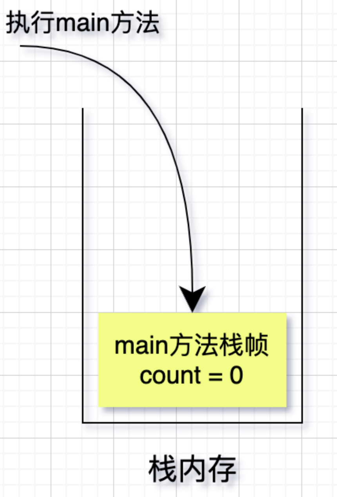

## 1.形参和实参

形参： 就是形式参数，用于定义方法的时候使用的参数，是用来接收调用者传递的参数的。

实参： 就是实际参数，用于调用时传递给方法的参数。实参在传递给别的方法之前是要被预先赋值的。

```java
public class ValueTransferDemo {
    public static void main(String[] args) {
        //这里的count就是实参
        int count = 0;
        update(count);
        System.out.println("main中的count："+ count);
    }

    //这方法中的参数就是形参
    public static void update(int count){
        count++;
        System.out.println("update中的count："+ count);
    }
}
```

在Java方法调用的过程中，就是把实参传递给形参，形参的作用域在方法内部。

## 2.值传递和引用传递

* **值传递**： 是指在调用方法时，将实际参数拷贝一份传递给方法，这样在方法中修改形式参数时，不会影响到实际参数。
* **引用传递**： 也叫地址传递，是指在调用方法时，将实际参数的地址传递给方法，这样在方法中对形式参数的修改，将影响到实际参数。
* **总结**：值传递，传递的是副本；引用传递，传递的是实际内存地址。

## 3.测试验证

### 3.1 基本数据类型验证

#### 代码展示

```java
public class ValueTransferDemo {
    public static void main(String[] args) {
        //这里的count就是实参
        int count = 0;
        update(count);
        System.out.println("main中的count："+ count);
    }

    //这方法中的参数就是形参
    public static void update(int count){
        count++;
        System.out.println("update中的count："+ count);
    }
}

//输出结果：
update中的count：1
main中的count：0
```

结论：可以看到虽然update方法修改了形参count的值，但是main方法中实参count的值并没有变。

> Java基本数据类型是存储在虚拟机栈内存中，栈中存放着栈帧，方法调用的过程，就是栈帧在栈中入栈、出栈的过程。

#### 原理剖析

当执行main方法的时候，就往虚拟机栈中压入一个栈帧，栈帧中存储的局部变量信息是count=0。



当执行update方法的时候，再往虚拟机栈中压入一个栈帧，栈帧中存储的局部变量信息是count=0。


修改update栈帧中数据，显然不会影响到main方法栈帧的数据。

### 3.2 引用类型验证

#### 3.2.1 同一地址

##### 代码展示

```java
public class ValueTransferTest {
    public static void main(String[] args) {
        User user = new User();
        user.setName("hurenxiang");
        changeVal(user);
        System.out.println("main方法里面的user"+ user);
    }

    public static void changeVal(User user){
        user.setName("superman");
        System.out.println("chanVal方法里面的user"+ user);
    }
}

结果：
chanVal方法里面的userUser{name='superman'}
main方法里面的userUser{name='superman'}
```

可以看出update方法修改user对象的属性，main方法中user对象也跟着变了。

##### 原理剖析


这里在参数传递的过程中，只是把实参的地址拷贝了一份传递给形参，update方法中只修改了参数地址里面的内容，并没有对形参本身进行修改。

#### 3.2.2 不同地址

##### 代码展示

```java
public class ValueTransferTest {
    public static void main(String[] args) {
        User user = new User();
        user.setName("hurenxiang");
        changeVal(user);
        System.out.println("main方法里面的user"+ user);
    }

    public static void changeVal(User user){
        user = new User();
        user.setName("superman");
        System.out.println("chanVal方法里面的user"+ user);
    }
}

结果：
chanVal方法里面的userUser{name='superman'}
main方法里面的userUser{name='hurenxiang'}
```

由代码得知，update方法中重新初始化了user对象，并重新赋值，并不影响main方法中实参数据。

##### 原理剖析

当执行main方法时，会在堆内存中开辟一块内存，在栈内存中压入一个栈帧，栈帧中存储一个引用，指向堆内存中的地址。


当调用update方法时，会把main方法的栈帧拷贝一份，再压入栈内存中，指向同一个堆内存地址。


当执行update方法，重新初始化user对象，并重新赋值的时候。会在堆内存中再开辟一块内存，再把栈内存中update栈帧指向新的堆内存地址，并修改新的堆内存中的数据。


从这里可以看出是值传递，修改了形参里面数据，实参并没有跟着变化。

## 4.总结

经过上述分析，Java参数传递中，不管传递的是基本数据类型还是引用类型，都是值传递。

当传递基本数据类型，比如原始类型（int、long、char等）、包装类型（Integer、Long、String等），实参和形参都是存储在不同的栈帧内，修改形参的栈帧数据，不会影响实参的数据。

当传参的引用类型，形参和实参指向同一个地址的时候，修改形参地址的内容，会影响到实参。当形参和实参指向不同的地址的时候，修改形参地址的内容，并不会影响到实参。