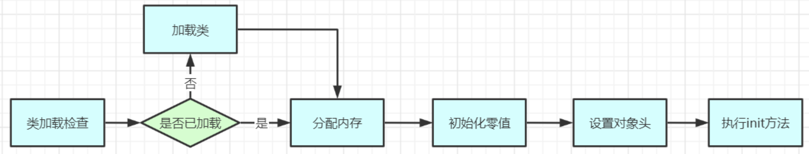
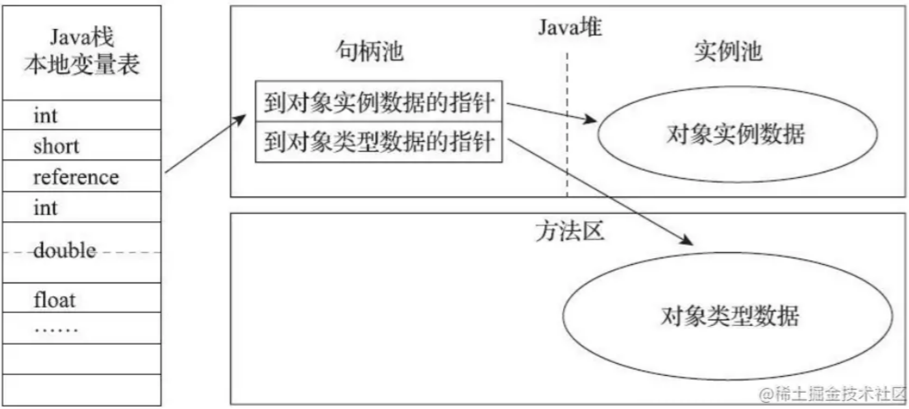
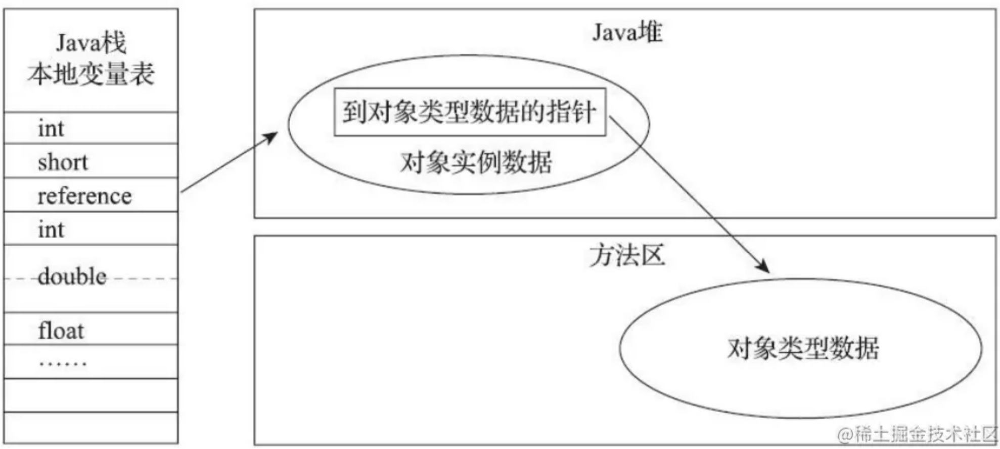
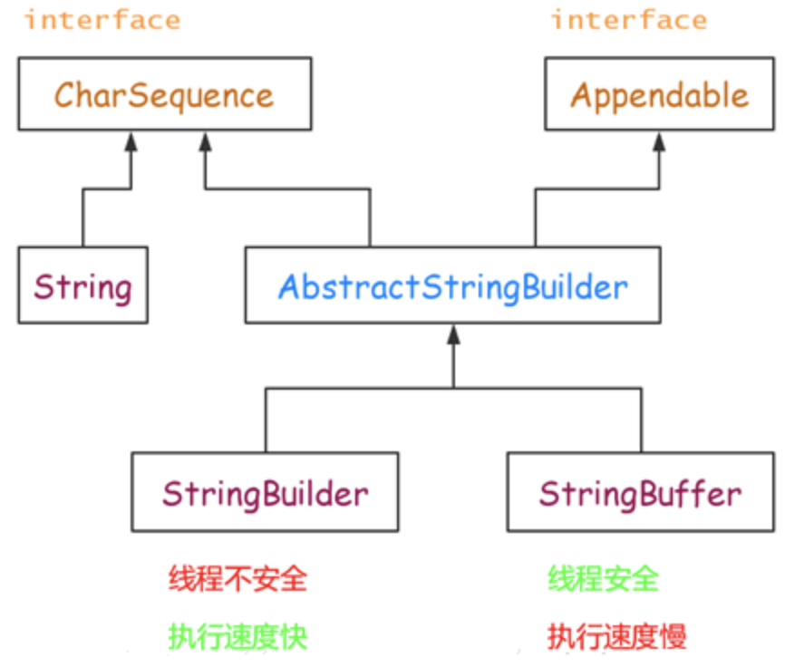
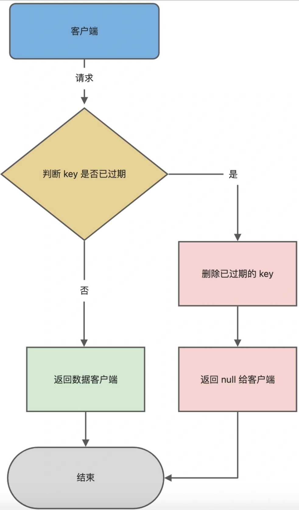
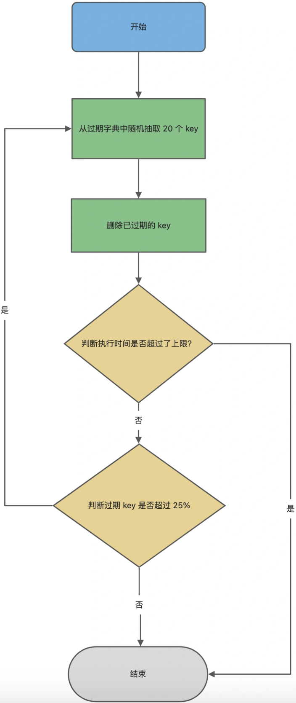

# 集合

## 1. ArrayList和LinkedList区别

1. 底层数据结构：ArrayList是基于数组实现的，而LinkedList是基于双向链表实现的。
2. 插入和删除操作：由于ArrayList是基于数组实现的，所以在插入和删除元素时，需要移动数组中的元素，因此在频繁插入和删除元素时，ArrayList的效率比LinkedList低。而LinkedList的插入和删除操作只需要改变链表中元素的指针，因此在频繁插入和删除元素时，LinkedList的效率比ArrayList高。
3. 访问操作：由于ArrayList是基于数组实现的，所以在访问元素时，可以直接根据索引访问，因此在随机访问元素时，ArrayList的效率比LinkedList高。而LinkedList需要从头开始遍历链表，直到找到需要访问的元素，因此在随机访问元素时，LinkedList的效率比ArrayList低。
4. 内存使用：由于LinkedList需要为每个元素维护一个指针，所以在存储大量元素时，LinkedList的内存占用比ArrayList高。

因此，如果需要频繁插入和删除元素，且不需要随机访问元素，则可以使用LinkedList；如果需要随机访问元素，或者集合中的元素数量比较小，则可以使用ArrayList。


# JVM

## 1. Java对象的创建流程



#### 类加载检查

虚拟机遇到一条`new`指令时，首先将去检查这个指令的参数是否能在常量池中定位到一个类的符号引用，并且检查这个符号引用代表的类是否已被加载、解析和初始化过。如果没有，那必须先执行相应的类加载过程。

`new`指令对应到语言层面上讲是，`new`关键词、对象克隆、对象序列化等。

#### 分配内存

在类加载检查通过后，接下来虚拟机将为新生对象分配内存。对象所需内存的大小在类加载完成后便可完全确定，为对象分配空间的任务等同于把 一块确定大小的内存从`Java`堆中划分出来。

**这个步骤有两个问题：**

1. 如何划分内存。

> 分配内存的方法

* “指针碰撞”（Bump the Pointer）(默认用指针碰撞)

如果Java堆中内存是绝对规整的，所有用过的内存都放在一边，空闲的内存放在另一边，中间放着一个指针作为分界点的指示器，那所分配内存就仅仅是把那个指针向空闲空间那边挪动一段与对象大小相等的距离。

- “空闲列表”（Free List）

如果Java堆中的内存并不是规整的，已使用的内存和空 闲的内存相互交错，那就没有办法简单地进行指针碰撞了，虚拟机就必须维护一个列表，记录上哪些内存块是可用的，在分配的时候从列表中找到一块足够大的空间划分给对象实例， 并更新列表上的记录

2. 内存分配同步：在并发情况下， 可能出现正在给对象A分配内存，指针还没来得及修改，对象B又同时使用了原来的指针来分配内存的情况。

> 解决并发问题的方法

- CAS（compare and swap）对分配内存空间的动作进行同步处理

虚拟机采用**CAS配上失败重试**的方式保证更新操作的原子性。

#### 初始化零值

内存分配完成后，虚拟机需要将分配到的内存空间都初始化为零值（不包括对象头）， 如果使用本地线程分配缓冲(TLAB)，这一工作过程也可以提前至TLAB分配时进行。这一步操作保证了对象的实例字段在Java代码中可以不赋初始值就直接使用，程序能访问到这些字段的数据类型所对应的零值。

#### 设置对象头

初始化零值之后，虚拟机要对对象进行必要的设置，例如这个对象是哪个类的实例、如何才能找到类的元数据信息、对象的哈希码、对象的GC分代年龄等信息。**这些信息存放在对象的对象头Object Header之中**。

#### 执行`init`方法

执行`init`方法，即对象按照程序员的意愿进行初始化。为属性赋值和执行构造方法。

## 2. 对象怎么定位

java通过栈中的reference数据来操作堆中的具体对象。 java中没有明确规定reference数据应该怎样去引用。

常见的两种reference访问方式：句柄和直接指针方式

#### 句柄



* 当使用句柄方式访问堆中的对象时，java堆中会划分出一块内存区域，reference中存储的就是句柄的地址，而句柄中包含了对象的实例数据与类型数据各自的地址信息。

* 句柄是一个间接的指针，它不直接指向对象的内存地址，而是指向一个指针表格（或类似的结构)，这个表格中包含了指向实际对象内存地址的指针。使用句柄的好处在于，当对象被移动时，只需要修改指针表格中的指针即可，而不需要修改所有指向该对象的指针。

#### 直接指针



* 当使用直接指针方式访问堆中的对象时，java堆中需要考虑如何放置对象的实例数据，reference中存储的直接就是对象地址。如果只是访问对象的话，就不需要多一次间接访问的开销。

# 基础

## 1. Str,StrBuffer,StrBuilder区别



**String**

* `String`类是不可变类，即一旦一个`String`对象被创建以后，包含在这个对象中的字符序列是不可改变的，直至这个对象被销毁

* 实现了`CharSequence`接口

**StringBuffer**

* 可变的字符序列
* 实现了`CharSequence`接口
* 线程安全，执行速度慢

**StringBuilder**

* 可变的字符序列
* 实现了`CharSequence`接口
* 线程不安全，执行速度快

> 总结

**线程安全方面**

`StringBuffer`：线程安全
`StringBuilder`：线程不安全

**速度方面**

一般情况下，速度从快到慢为 `StringBuilder` > `StringBuffer` > `String`，当然这是相对的，不是绝对的。

**使用环境方面**

操作少量的数据使用 `String`
单线程操作大量数据使用 `StringBuilder`
多线程操作大量数据使用 `StringBuffer`

# Redis

## 1.Redis单线程为什么那么快

**严格来说，Redis Server是多线程的，只是它的请求处理整个流程是单线程处理的。**这一点我们一定要清楚了解到，不要单纯地认为Redis Server是单线程的！

Redis的性能非常之高，每秒可以承受10W+的QPS，它如此优秀的性能主要取决于以下几个方面：

- 纯内存操作
- 使用IO多路复用技术
- 非CPU密集型任务
- 单线程的优势

#### 纯内存操作

Redis是一个内存数据库，它的数据都存储在内存中，这意味着我们读写数据都是在内存中完成，这个速度是非常快的。

Redis是一个KV内存数据库，它内部构建了一个哈希表，根据指定的KEY访问时，只需要O(1)的时间复杂度就可以找到对应的数据。同时，Redis提供了丰富的数据类型，并使用高效的操作方式进行操作，这些操作都在内存中进行，并不会大量消耗CPU资源，所以速度极快。

#### 使用IO多路复用技术

Redis采用单线程，那么它是如何处理多个客户端连接请求呢？

Redis采用了IO多路复用技术和非阻塞IO，这个技术由操作系统实现提供，Redis可以方便地操作系统的API即可。Redis可以在单线程中监听多个Socket的请求，在任意一个Socket可读/可写时，Redis去读取客户端请求，在内存中操作对应的数据，然后再写回到Socket中。

整个过程非常高效，Redis利用了IO多路复用技术的事件驱动模型，保证在监听多个Socket连接的情况下，只针对有活动的Socket采取反应。

#### 非CPU密集型任务

采用单线程的缺点很明显，无法使用多核CPU。Redis作者提到，由于Redis的大部分操作并不是CPU密集型任务，而Redis的瓶颈在于内存和网络带宽。

在高并发请求下，Redis需要更多的内存和更高的网络带宽，否则瓶颈很容易出现在内存不够用和网络延迟等待的情况。

当然，如果你觉得单个Redis实例的性能不足以支撑业务，Redis作者推荐部署多个Redis节点，组成集群的方式来利用多核CPU的能力，而不是在单个实例上使用多线程来处理。

#### 单线程的优势

基于以上特性，Redis采用单线程已足够达到非常高的性能，所以Redis没有采用多线程模型。

另外，单线程模型还带了以下好处：

- 没有了多线程上下文切换的性能损耗
- 没有了访问共享资源加锁的性能损耗
- 开发和调试非常友好，可维护性高

所以Redis正是基于以上这些方面，所以采用了单线程模型来完成请求处理的工作。

## 2.Redis持久化原理

#### 2.1 场景

`Redis`是一个内存数据库，所有的数据将保存在内存中，这与传统的`MySQL`、`Oracle`、`SqlServer`等关系型数据库直接把数据保存到硬盘相比，`Redis`的读写效率非常高。但是保存在内存中也有一个很大的缺陷，一旦断电或者宕机，内存数据库中的内容将会全部丢失。为了弥补这一缺陷，Redis提供了把内存数据持久化到硬盘文件，以及通过备份文件来恢复数据的功能，即`Redis`持久化机制。

Redis支持三种方式的持久化：`RDB`、`AOF`和`RDB+AOF`

#### 2.2 RDB持久化

`RDB`（`Redis DataBase`）持久化是一种基于快照的持久化方式。在指定的时间间隔内，如果满足一定条件（如某段时间内发生的写操作次数），Redis会生成一个包含当前内存数据的`RDB`文件。这个`RDB`文件可以用于数据恢复或备份。`RDB`持久化提供了较高的数据压缩率和快速的数据加载速度，但可能存在一定程度的数据丢失。

##### **2.2.1 RDB持久化原理**

RDB持久化是基于快照的持久化，把当前时刻全量数据持久化到磁盘上，最终生成一个RBD文件。

##### **2.2.2 RDB持久化触发方式**

* **手动触发**：使用**`SAVE`**或**`BGSAVE`**命令。**`SAVE`**是同步命令，执行过程中会阻塞其他请求。**`BGSAVE`**是异步命令，主进程会**`forks`**一个子进程，进行异步持久化，持久化过程中主进程仍然可以处理其他请求。
* **自动触发**：在配置文件中设置触发条件，**`redis.conf`**配置如下：

        ```java
        # 900s内至少有一次写操作
        save 900 1
        # 300s内至少有1次写操作
        save 300 10
        # 60s内至少有10000次写操作
        save 60 10000
        ```

* **关闭Redis时触发**：`Redis`在关闭服务时会自动触发一次`RDB`持久化。
* **主从同步时触发**：当从节点连接到主节点时，主节点会触发一次RDB持久化，并将生成的RDB文件发送给从节点进行同步。

##### 2.2.3 **RDB优缺点**

**RDB持久化优点：**

1. 高性能：由于采用子进程进行磁盘操作，主进程无需进行磁盘IO，保证了Redis的高性能。

2. 快速恢复：RDB文件包含了某一时刻的完整数据快照，可以快速恢复数据。
2. 更小的存储空间：RDB文件经过压缩，占用较小的磁盘空间。

**RDB持久化缺点：**

1. 数据丢失：由于RDB持久化是基于时间间隔的，可能存在一定程度的数据丢失。

2. 子进程占用内存：在生成RDB文件过程中，子进程会占用和主进程相同的内存空间，可能导致内存不足的问题。

#### 2.3 AOF持久化

`AOF`（`Append Only File`）持久化是一种基于日志的持久化方式。Redis将所有的写操作命令追加到一个AOF文件中。当Redis重新启动时，可以通过重放AOF文件中的命令来恢复数据。

##### **2.3.1 AOF持久化的配置**

* 启用AOF持久化：在配置文件中设置`appendonly yes`。

   ```java
   # 开启aof持久化
   appendonly yes
   
   # aof文件名
   appendfilename "appendonly.aof"
   ```

* `AOF`文件同步策略：在配置文件中设置**`appendfsync`**选项。可选值包括：
  - `always`：每次写操作都同步到磁盘，保证最高的数据安全性，但性能较差。
  - `everysec`：每秒同步一次磁盘，提供较好的数据安全性和性能平衡。
  - `no`：由操作系统决定何时同步磁盘，性能最好，但数据安全性较差。

```java
# 持久化策略，always表示每次写入都进行持久化
appendfsync always
```

* `AOF`重写策略：在`redis.conf`文件中进行配置，控制`AOF`重写的触发条件。

```java
# 指定在执行BGSAVE或BGREWRITEAOF命令时是否禁用AOF文件同步。默认为yes，表示禁用同步。
no-appendfsync-on-rewrite yes

# 指定AOF文件大小增长到原始大小的百分比时进行重写。
# 默认为100，表示AOF文件大小增长到原始大小的两倍时进行重写。
auto-aof-rewrite-percentage 100

# 指定进行AOF重写的最小AOF文件大小。默认为64mb。
auto-aof-rewrite-min-size 64
```

##### 2.3.2 **AOF优缺点**

**AOF持久化优点：**

1. 更高的数据安全性：根据同步策略的选择，`AOF`持久化可以保证较高的数据安全性。
2. 更好的容错性：即使`AOF`文件存在部分损坏，仍可以恢复大部分数据。

**AOF持久化缺点：**

1. 较大的存储空间：与`RDB`持久化相比，`AOF`文件通常较大，占用较多磁盘空间。
2. 数据加载速度较慢：由于需要重放`AOF`文件中的命令，数据恢复速度相对较慢。

#### 2.4 混合持久化

如果开启了混合持久化，`AOF`在重写时，不再是单纯将内存数据转换为`RESP`命令写入`AOF`文件，而是将重写这一刻之前的内存做RDB快照处理并且将`RDB`快照内容和增量的`AOF`修改内存数据的命令存在一起，都写入新的`AOF`文件，新的文件一开始不叫`appendonly.aof`,等到重写完新的`AOF`文件才会进行改名，覆盖原有的`AOF`文件，完成新旧两个`AOF`文件的替换。于是在`Redis`重启的时候，可以先加载`RDB`的内容，然后再重放增量`AOF`日志就可以完全替代之前的`AOF`全量文件重放，因此重启效率大幅得到提升

## 3.Redis过期键删除策略

#### 3.1 常见的删除策略

##### **3.1.1 定时删除**

在设置 `key` 的过期时间时，同时创建一个定时事件，当时间到达时，由事件处理器自动执行 `key` 的删除操作。

**定时删除策略的优点**

* 可以保证过期 `key` 会被尽快删除，也就是内存可以被尽快地释放。因此，定时删除对内存是最友好的。

**定时删除策略的缺点**

* 在过期 `key` 比较多的情况下，删除过期 `key` 可能会占用相当一部分 `CPU` 时间，在内存不紧张但 `CPU` 时间紧张的情况下，将 `CPU` 时间用于删除和当前任务无关的过期键上，无疑会对服务器的响应时间和吞吐量造成影响。所以，定时删除策略对 `CPU` 不友好。

##### **3.1.2 惰性删除**

每次从键空间中获取键时，检查该键是否过期，如果过期，删除该键；如果没有删除，返回该键

**惰性删除策略的优点**

* 因为每次访问时，才会检查 `key` 是否过期，所以此策略只会使用很少的系统资源，因此，惰性删除策略对 `CPU` 时间最友好。

**惰性删除策略的缺点**

* 如果一个 key 已经过期，而这个 `key` 又仍然保留在数据库中，那么只要这个过期 `key` 一直没有被访问，它所占用的内存就不会释放，造成了一定的内存空间浪费。所以，惰性删除策略对内存不友好。

##### **3.1.3 定期删除**

每隔一段时间「随机」从数据库中取出一定数量的 `key` 进行检查，并删除其中的过期`key`。

定期删除策略的优点**

- 通过限制删除操作执行的时长和频率，来减少删除操作对 `CPU` 的影响，同时也能删除一部分过期的数据减少了过期键对空间的无效占用。

**定期删除策略的缺点**

- 内存清理方面没有定时删除效果好，同时没有惰性删除使用的系统资源少。
- 难以确定删除操作执行的时长和频率。如果执行的太频繁，定期删除策略变得和定时删除策略一样，对`CPU`不友好；如果执行的太少，那又和惰性删除一样了，过期 `key` 占用的内存不会及时得到释放。

#### 3.2 redis删除策略

##### 3.2.1 redis惰性删除

Redis 的惰性删除策略由 `db.c` 文件中的 `expireIfNeeded` 函数实现

Redis 在访问或者修改 `key` 之前，都会调用 `expireIfNeeded` 函数对其进行检查，检查 `key` 是否过期：

- 如果过期，则删除该 `key`，至于选择异步删除，还是选择同步删除，根据 `lazyfree_lazy_expire` 参数配置决定（Redis 4.0版本开始提供参数），然后返回 `null` 客户端；
- 如果没有过期，不做任何处理，然后返回正常的键值对给客户端；

**惰性删除的流程图如下：**



##### 3.2.2 redis定期删除

**间隔检查的时间是多长呢？**

* 在 `Redis` 中，默认每秒进行 `10` 次过期扫描，此配置可通过 `Redis` 的配置文件 `redis.conf` 进行配置，配置键为 `hz` 它的默认值是 `hz 10`。

* 特别强调下，每次检查数据库并不是遍历过期字典中的所有 `key`，而是从数据库中随机抽取一定数量的 `key` 进行过期检查。

**随机抽查的数量是多少呢**？

* 定期删除的实现在 expire.c 文件下的 `activeExpireCycle` 函数中，其中随机抽查的数量由 `ACTIVE_EXPIRE_CYCLE_LOOKUPS_PER_LOOP` 定义的，它是写死在代码中的，数值是 20。

* 也就数据库每轮抽查时，会随机选择 20 个 key 判断是否过期。

**Redis 的定期删除的流程：**

1. 从过期字典中随机抽取 `20` 个 `key`；
2. 检查这 `20` 个 `key` 是否过期，并删除已过期的 `key`；
3. 如果本轮检查的已过期 `key` 的数量，超过 `5` 个（20/4），也就是「已过期 `key` 的数量」占比「随机抽取 `key` 的数量」大于 `25%`，则继续重复步骤 1；如果已过期的 `key` 比例小于 `25%`，则停止继续删除过期 `key`，然后等待下一轮再检查。



## 4.Redis内存淘汰策略


## 5.redis缓存如何回收


## 6.redis集群方案有哪些


## 7.redis事务是如何实现的


## 8.redis主从复制的原理


## 9.击穿、穿透、雪崩、预热


# MySQL

## 1.MySQL隔离级别有哪些

#### MySQL定义了四种事务隔离级别

* 读未提交`(Read Uncommitted)`

* 读已提交`(Read Committed)`
* 可重复读`(Repeatable Read)`
* 串行化`(Serializable)`

`MySQL` 中默认事务隔离级别是可重复读`(Repeatable Read)`。

|     隔离级别     | 脏读 | 不可重复读 | 幻读 |
| :--------------: | :--: | :--------: | :--: |
| Read Uncommitted |  ✅   |     ✅      |  ✅   |
|  Read Committed  |  ❎   |     ✅      |  ✅   |
| Repeatable Read  |  ❎   |     ❎      |  ✅   |
|   Serializable   |  ❎   |     ❎      |  ❎   |

* 读未提交`(Read Uncommitted)`允许脏读，就是在该隔离级别下，可能读到其他会话未提交事务修改的数据，存在脏读、不可重读读、幻读的问题。
* 读已提交`(Read Committed)`只能查询到已提交的数据。这是 `Oracle` 数据库默认的事务隔离级别。存在不可重读读、幻读的问题。
* 可重复读`(Repeatable Read)`就是在一个事务里相同条件下，无论何时查到的数据都和第一次查到的数据一致。这是 `MySQL` 数据库 `InnoDB` 引擎默认的事务隔离级别。在范围查询时存在幻读的问题。
* 串行化`(Serializable)`是最高的事务隔离级别，它严格服从 `ACID` 特性的隔离级别。所有的事务依次逐个执行，事务之间互不干扰，该级别可以防止脏读、不可重复读以及幻读。但每个事务读数据时都需要获取表级的共享锁，导致读和写都会阻塞，性能极低。

#### 如何查看 MySQL 事务隔离级别

```apl
# MySQL 8.0 之前
SELECT @@global.tx_isolation;
SELECT @@session.tx_isolation;
SELECT @@tx_isolation;

# MySQL8.0
SELECT @@global.transaction_isolation;
SELECT @@session.transaction_isolation;
SELECT @@transaction_isolation;
```

## 2.MySQL复制原理
