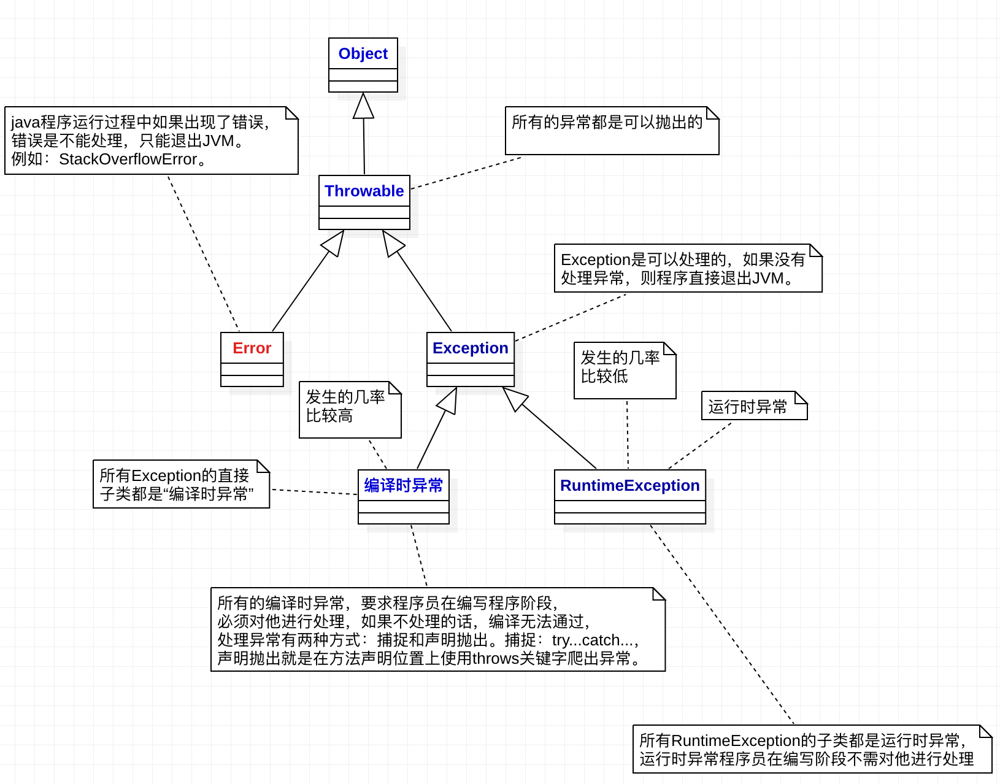
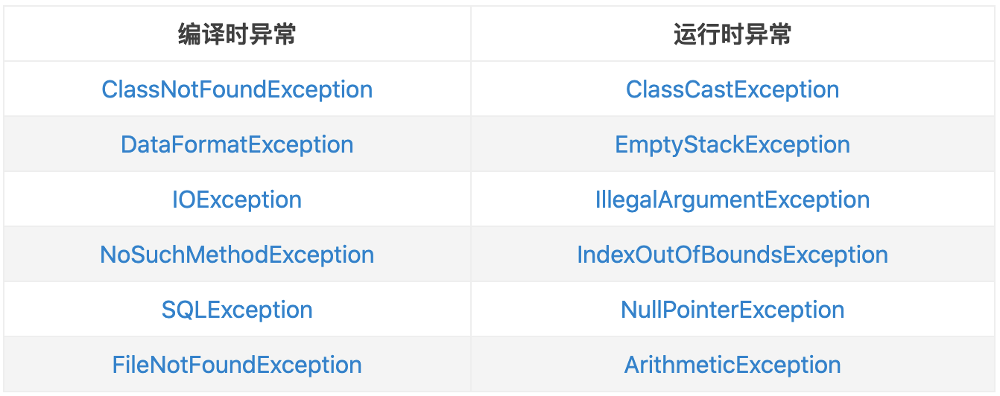

## 1. 异常概念

* 异常指的是程序在执行过程中，出现的非正常的情况，最终会导致JVM的非正常停止。
* 在`Java`面向对象的编程语言中，异常本身是一个类，产生异常就是创建异常对象并抛出一个异常对象。`Java`处理异常的方式是中断处理。


## 2. 异常体系





## 3. 异常产生过程解析  

**异常类**

```java
public class Demo1Exception {
    public static void main(String[] args) {
        int[] arr = {1,2,3};
        int e = getElement(arr,3);
        System.out.println(e);
    }

    public static int getElement(int[] arr, int index){
        int ele = arr[index];
        return ele;
    }
}
```

**输出结果**

```java
Exception in thread "main" java.lang.ArrayIndexOutOfBoundsException: 3
	at com.hurenxiang.Exception.Demo1Exception.getElement(Demo1Exception.java:11)
	at com.hurenxiang.Exception.Demo1Exception.main(Demo1Exception.java:6)
```

### 过程解析

1. 访问了数组中的`3`索引，而数组是没有3索引的，这时候，`jvm`就会检测出程序会出现的异常，JVM会做两件事：
   * `JVM`会根据异常产生的原因创建一个异常对象，这个异常对象包含了异常产生的(内容、原因、位置)
   * 在`getElement`方法中，没有异常处理的处理逻辑(`try...catch`)，那么JVM会把异常对象抛出给方法的调用者`main`方法来处理

2. `main`方法接收到了这个异常对象，`main`方法也没有异常的处理逻辑，继续把对象抛出给`main`方法的调用者`JVM`处理
3. `JVM`接收到了这个异常对象，做了两件事情：
   * 把异常对象(内容、原因、位置)以红色的字体打印在控制台
   * `JVM`会终止当前正在执行的`java`程序

综上，`1--->2`这个过程，是`getElement`方法把异常对象抛出给`main`；

​            `2--->3`这个过程，`main`方法把异常对象抛出给`JVM`。

## 4. 异常处理

Java异常处理的5个关键词：`try`、`catch`、`finally`、`throw`、`throws`

### 4.1 throw

**作用：**

可以使用`throw`关键字在指定的方法中抛出指定的异常

**使用格式：**

`throw new 异常类名(参数)`

**例如：**

`throw new NullPointerException("要访问的arr数组不存在");`

**注意：**

* `throw`关键字必须写在方法的内部
* `throw`关键字后边`new`的对象必须是`Exception`或者`Exception`的子类对象
* `throw`关键字抛出指定的异常对象，我们必须处理这个异常对象
  * `throw`关键字后边创建的是`RuntimeException`或者是`RuntimeException`的子类对象，我们可以不处理，默认交给`JVM`处理(打印异常对象，中断程序)
  * `throw`关键字后边创建的是编译异常(写代码的时候报错)，我们必须处理这个异常，要么`throws`，要么`try...catch`

**案例展示：**

```java
public class ThrowException {
    public static void main(String[] args) {
        int[] arr = null;
        int e = getElement(arr,0);
    }

    public static int getElement(int[] arr,int index){
        //对传递过来的参数数组进行合法性校验，如果是数组arr的值为null，
        //抛出空指针异常，告知方法的调用者"传递的数组的值是null"
        if (arr == null){
            throw new NullPointerException("传递的数组的值是null");
        }
        int ele = arr[index];
        return ele;
    }
}
```

**运行结果：**

```java
Exception in thread "main" java.lang.NullPointerException: 传递的数组的值是null
	at com.hurenxiang.Exception.ThrowException.getElement(ThrowException.java:13)
	at com.hurenxiang.Exception.ThrowException.main(ThrowException.java:6)
```

### 4.2 throws

**概述**

异常处理的第一种方式，交给别人处理

**作用**

当方法内部抛出异常对象的时候，那么我们必须处理这个异常对象

可以使用`throws`关键字处理异常对象，会有异常对象声明抛出给方法的调用者处理(自己不处理，给别人处理)，最终交给`JVM`处理-->中断处理

**使用格式**

```java
修饰符  返回值类型  方法名(参数列表) throws AAAException , BBBException ...{
     throw new AAAException("产生原因");
     throw new BBBException("产生原因");
}
```

**注意**

* `throws`关键字必须写在方法声明处
* `throws`关键字后边声明的异常必须是`Exception`或是`Exception`的子类
* 方法内部如果抛出了多个异常对象，那么`throws`后边必须也声明多个异常
  * 如果抛出的多个异常对象有子父类关系，那么直接声明父类异常即可
* 调用了一个声明抛出异常的方法，必须处理声明的异常
  * 要么继续使用`throws`声明抛出，交给方法的调用者处理，最终交给`JVM`
  * 要么`try...catch`自己处理异常

**案例展示**

```java
public class ThrowsException {
    public static void main(String[] args) throws FileNotFoundException {
        //调用异常方法，由JVM进行处理，read方法下面的语句不会继续执行
        read("a.tx");
        System.out.println("11111");
    }

    //方法中抛出异常，调用者也需要抛出异常
    public static void read(String path) throws FileNotFoundException {
        if (!"a.txt".equals(path)){
            //该异常是编译时异常，需要通过throws或者try...catch进行捕获异常
            throw new FileNotFoundException("文件不存在");
        }
    }
}
```

**运行结果**

```java
Exception in thread "main" java.io.FileNotFoundException: 文件不存在
	at com.hurenxiang.Exception.ThrowsException.read(ThrowsException.java:12)
	at com.hurenxiang.Exception.ThrowsException.main(ThrowsException.java:7)
```

### 4.3 try...catch

**概述**

异常处理的第二种方式，自己处理异常

**格式**

```java
try{
    可能产生异常的代码
}catch(定义一个异常的变量，用来接收try中抛出的异常对象){
    异常的处理逻辑，产生异常对象之后，怎么处理异常对象
    一般在工作中，会把异常的信息记录到一个日志中
}
```

**注意**

* `try`中可能会抛出多个异常对象，那么就可以使用多个`catch`来处理这些异常对象
* 如果`try`中产生了异常，就会执行`catch`中的异常处理逻辑 ，执行完毕`catch`中的处理逻辑，继续执行`try...catch`之后的代码
* 如果`try`中没有产生异常，就不会执行`catch`中异常处理逻辑，执行完`try`中的代码，继续执行`try...catch`之后的代码

**案例展示**

```java
public class tryException {
    public static void main(String[] args) {
        try {
            readFile("d://a.tx");
          //捕获异常，打印异常，下面的代码继续还行
        } catch (IOException e) {
            e.printStackTrace();
        }
        System.out.println("后续代码");
    }

    public static void readFile(String fileName) throws IOException {
        if (!fileName.endsWith(".txt")){
            throw new IOException("文件的后缀不对");
        }
    }
}
```

**运行结果**

```java
java.io.IOException: 文件的后缀不对
	at com.hurenxiang.Exception.tryException.readFile(tryException.java:20)
	at com.hurenxiang.Exception.tryException.main(tryException.java:11)
后续代码
```

### 4.4 异常处理方法

```java
public class tryException {
    public static void main(String[] args) {
        try {
            readFile("d://a.tx");
        } catch (IOException e) {
            //第一种：e.getMessage()
            System.out.println(e.getMessage());
            //第二种：e.toString()
            System.out.println(e.toString());
            //第三种：e.printStackTrace()
            e.printStackTrace();
        }
        System.out.println("后续代码");
    }

    public static void readFile(String fileName) throws IOException {
        if (!fileName.endsWith(".txt")){
            throw new IOException("文件的后缀不对");
        }
    }
}
```

**结果输出**

```java
//第一种方法输出
文件的后缀不对
//第二种方法输出
java.io.IOException: 文件的后缀不对
后续代码
//第三种方法输出
java.io.IOException: 文件的后缀不对
	at com.hurenxiang.Exception.tryException.readFile(tryException.java:22)
	at com.hurenxiang.Exception.tryException.main(tryException.java:11)

```

### 4.5 finally

**格式**

```java
try{
   可能产生异常的代码
}catch(定义一个异常的变量，用来接收try中抛出的异常对象){
   异常的处理逻辑
}finally{
   无论是否出现异常都会执行
}
```

**注意**

* `finally`不能单独使用，必须和`try`一起使用
* `finally`一般用于资源释放(资源回收)，无论程序是否出现异常，最后都要资源释放

```java
public class FinallyException {
    public static void main(String[] args) {
        try {
            readFile("d://a.tx");
        } catch (IOException e) {
            e.printStackTrace();
        } finally {
            System.out.println("后续代码");
        }
    }

    public static void readFile(String fileName) throws IOException {
        if (!fileName.endsWith(".txt")){
            throw new IOException("文件的后缀不对");
        }
    }
}
```

**结果输出**

```java
java.io.IOException: 文件的后缀不对
	at com.hurenxiang.Exception.FinallyException.readFile(FinallyException.java:18)
	at com.hurenxiang.Exception.FinallyException.main(FinallyException.java:8)
后续代码
```

