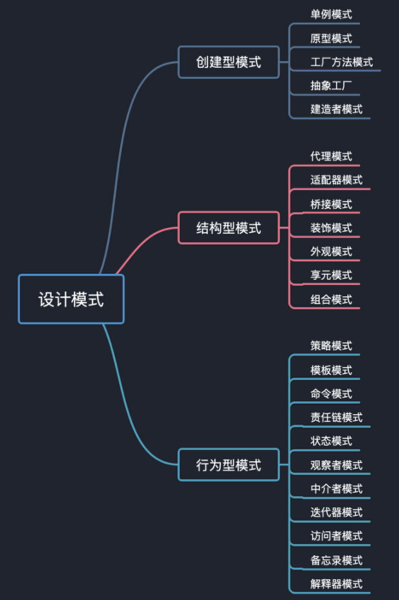
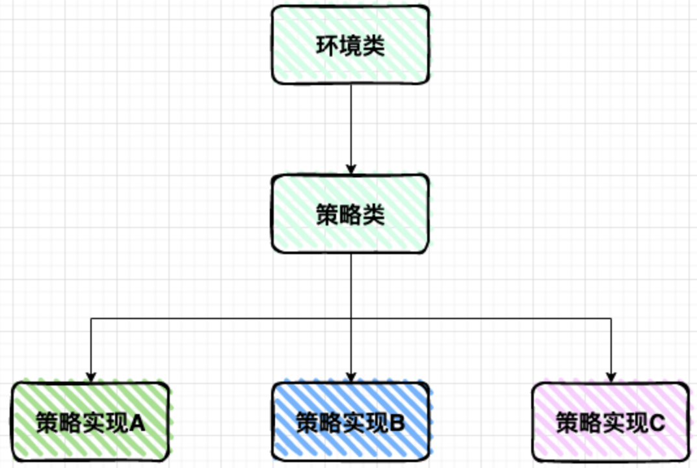
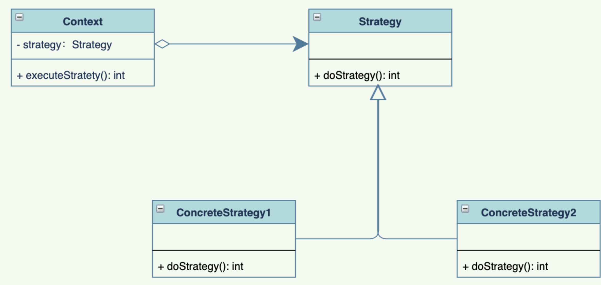
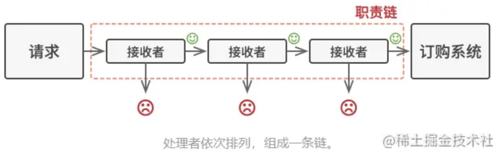

## 一、创建型模式


## 二、结构型模式


## 三、行为型模式

#### 3.1 策略模式



##### 策略角色

策略模式一般有三种角色：

- 抽象的策略类（`Strategy`）：将策略的行为抽象出公共接口
- 具体的策略类（`ConcreteStrategy`）:以`Strategy`接口实现某些具体的算法，具体的策略可能多个，也可以相互替换
- 上下文（`Context`）: 一般是封装了策略，以及策略的使用方法，对上层调用屏蔽了细节，直接调用即可。



##### 应用场景

策略模式是一种行为型设计模式，其主要目的是在运行时动态地改变对象的行为，通过将一系列可相互替换的算法封装起来，并使得它们之间可以互换而不影响客户端的使用。

以下是策略模式的几个应用场景：

1. 表单验证：在表单提交时，可以根据不同的验证规则（如是否为空、是否符合正则表达式等）使用不同的验证策略。
2. 排序算法：在排序过程中，可以根据不同的排序算法（如冒泡排序、快速排序等）使用不同的排序策略。
3. 支付方式：在支付过程中，可以根据不同的支付方式（如支付宝、微信、银行卡等）使用不同的支付策略。
4. 游戏角色技能：在游戏中，可以根据不同的角色技能（如攻击技能、防御技能等）使用不同的技能策略。
5. 优惠券策略：在电商平台中，可以根据不同的优惠券类型（如满减、折扣、赠品等）使用不同的优惠策略。

总之，只要涉及到需要在运行时动态地改变对象的行为的情况，都可以考虑使用策略模式。

##### 代码解析

###### 原来版本

`controller`类

```java
@RestController
public class LogisticsController {

    @Autowired
    private LogisticsService logisticsService;

    @PostMapping("/calculate")
    private BigDecimal calculateFee(@RequestBody TransferFeeRequest transferFeeRequest) {
            return logisticsService.calculateFee(transferFeeRequest);
    }
}
```

`service`类

```java
public interface LogisticsService {
    BigDecimal calculateFee(TransferFeeRequest transferFeeRequest);
}
```

`serviceImpl`类

```java
@Service
public class Transfercompany implements LogisticsService{

    private BigDecimal pickFee = BigDecimal.TEN;

    private BigDecimal minDistance = BigDecimal.valueOf(80);

    private BigDecimal minDistance1 = BigDecimal.valueOf(60);

    private BigDecimal minDistance2 = BigDecimal.valueOf(40);


    @Override
    public BigDecimal calculateFee(TransferFeeRequest transferFeeRequest) {
        //type为1是顺丰 type为2是京东 type为3是中通
        if (Objects.equals(transferFeeRequest.getType(),1)) {
            BigDecimal distance = minDistance.compareTo(transferFeeRequest.getDistance()) > 0 ?
                    minDistance : transferFeeRequest.getDistance();
            BigDecimal fee = distance.multiply(transferFeeRequest.getUnitPrice()).add(pickFee);
            return fee;
        } else if (Objects.equals(transferFeeRequest.getType(),2)){
            BigDecimal distance = minDistance1.compareTo(transferFeeRequest.getDistance()) > 0 ?
                    minDistance1 : transferFeeRequest.getDistance();
            BigDecimal fee = distance.multiply(transferFeeRequest.getUnitPrice()).add(pickFee);
            // do business
            return fee;
        } else if (Objects.equals(transferFeeRequest.getType(),3)){
            BigDecimal distance = minDistance2.compareTo(transferFeeRequest.getDistance()) > 0 ?
                    minDistance2 : transferFeeRequest.getDistance();
            BigDecimal fee = distance.multiply(transferFeeRequest.getUnitPrice()).add(pickFee);
            // do business
            return fee;
        }
        return null;
    }
}
```

结论：原来的版本中，通过`type`类型进行各种场景的区分，多了很多的`if...else...`，维护起来很麻烦


###### 策略版本

`controller`类

```java
@RestController
public class LogisticsController {

    @Autowired
    private List<LogisticsService> logisticsService;

    @PostMapping("/calculate")
    private BigDecimal calculateFee(@RequestBody TransferFeeRequest transferFeeRequest) {
        LogisticsService logisticsService = this.logisticsService.stream().filter(l -> l.isCurrentLogistics(transferFeeRequest.getType()))
                .findFirst().orElse(null);
        if (logisticsService != null) {
            return logisticsService.calculateFee(transferFeeRequest);
        }
        return null;
    }
```

`service`类

```java
public interface LogisticsService {

    boolean isCurrentLogistics(Integer type);

    BigDecimal calculateFee(TransferFeeRequest transferFeeRequest);
}
```

`serviceImpl`类 -- 顺丰

```java
@Service
public class SFTransfercompany implements LogisticsService{

    private BigDecimal pickFee = BigDecimal.TEN;

    private BigDecimal minDistance = BigDecimal.valueOf(80);

    @Override
    public boolean isCurrentLogistics(Integer type) {
        return Objects.equals(type, 1);
    }

    @Override
    public BigDecimal calculateFee(TransferFeeRequest transferFeeRequest) {
        BigDecimal distance = minDistance.compareTo(transferFeeRequest.getDistance()) > 0 ?
                minDistance : transferFeeRequest.getDistance();
        BigDecimal fee = distance.multiply(transferFeeRequest.getUnitPrice()).add(pickFee);
        return fee;
    }
}
```

`serviceImpl`类 -- 京东

```java
@Service
public class JDTransfercompany implements LogisticsService{

    private BigDecimal pickFee = BigDecimal.TEN;

    private BigDecimal minDistance = BigDecimal.valueOf(60);

    @Override
    public boolean isCurrentLogistics(Integer type) {
        return Objects.equals(type, 2);
    }

    @Override
    public BigDecimal calculateFee(TransferFeeRequest transferFeeRequest) {
        BigDecimal distance = minDistance.compareTo(transferFeeRequest.getDistance()) > 0 ?
                minDistance : transferFeeRequest.getDistance();
        BigDecimal fee = distance.multiply(transferFeeRequest.getUnitPrice()).add(pickFee);
        // do business
        return fee;
    }
}
```

`serviceImpl`类 -- 中通

```java
@Service
public class ZTTransfercompany implements LogisticsService{

    private BigDecimal pickFee = BigDecimal.TEN;

    private BigDecimal minDistance = BigDecimal.valueOf(40);

    @Override
    public boolean isCurrentLogistics(Integer type) {
        return Objects.equals(type, 3);
    }

    @Override
    public BigDecimal calculateFee(TransferFeeRequest transferFeeRequest) {
        BigDecimal distance = minDistance.compareTo(transferFeeRequest.getDistance()) > 0 ?
                minDistance : transferFeeRequest.getDistance();
        BigDecimal fee = distance.multiply(transferFeeRequest.getUnitPrice()).add(pickFee);
        // do business
        return fee;
    }
}
```

#### 3.2 责任链模式

责任链模式是一种行为设计模式， 允许你将请求沿着处理者链进行发送。收到请求后， 每个处理者均可对请求进行处理， 或将其传递给链上的下个处理者。



##### 使用场景

- 多条件流程判断：权限控制
- ERP 系统流程审批：总经理、人事经理、项目经理
- Java 过滤器的底层实现 Filter

##### 代码解析

> 需求：如果有三个任务，每个任务都需要前一个任务的完成，才可以进行下一个任务，比如：完成第一个任务才可以完成第二个，完成第二个任务才可以完成第三个。要求：现有一个变量天数，如果小于3天，那么第一个任务完成；如果大于三天小于10天，那么第二个任务完成；如果大于10天小于15天，第三个任务完成。

`Handler`类 -- 抽象类

```java
public abstract class Handler {

    public Handler next;

    public void setNext(Handler next){
        this.next = next;
    }

    public abstract int handlerVal(int count);
}
```

`OneHandler`类 -- 继承类

```java
public class OneHandler extends Handler{

    @Override
    public int handlerVal(int count) {
        if (count < 3){
            System.out.println("完成了第一个任务");
        } else {
            if (next != null){
                next.handlerVal(count);
            }
        }
        return count;
    }
}
```

`TwoHandler`类 -- 继承类

```java
public class TwoHandler extends Handler{

    @Override
    public int handlerVal(int count) {
        if (count >= 3 && count <= 10){
            System.out.println("完成了第二个任务");
        } else {
            if (next != null){
                next.handlerVal(count);
            }
        }
        return count;
    }
}
```

`ThreeHandler`类 -- 继承类

```java
public class ThreeHandler extends Handler{

    @Override
    public int handlerVal(int count) {
        if (count < 15 && count > 10){
            System.out.println("完成了第三个任务");
        } else {
            System.out.println(".......");
        }
        return count;
    }
}

```

`Client`类

```java
public class Client {
    public static void main(String[] args) {
       OneHandler oneHandler = new OneHandler();
       TwoHandler twoHandler = new TwoHandler();
       ThreeHandler threeHandler = new ThreeHandler();

       oneHandler.setNext(twoHandler);
       twoHandler.setNext(threeHandler);

       oneHandler.handlerVal(13);
    }
}
```


